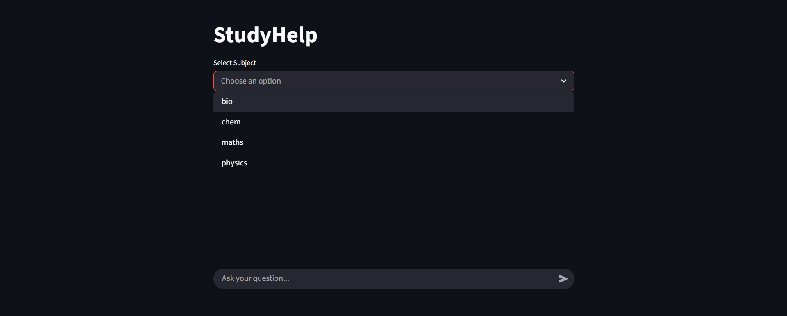
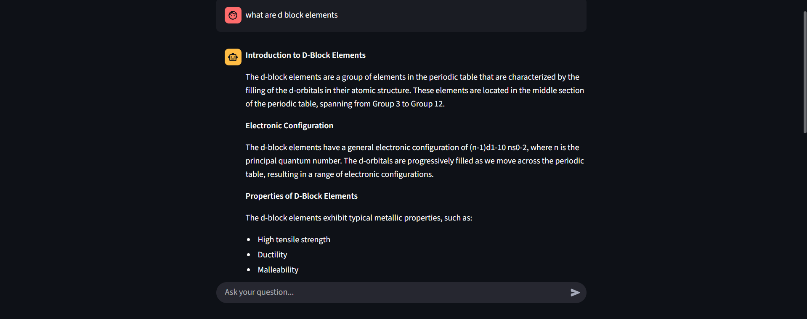

# 📚 StudyHelp AI - RAG Based NCERT Learning Assistant

An AI-powered educational assistant that answers **Class 12 NCERT** questions using **Retrieval-Augmented Generation (RAG)**. Instead of relying solely on a Large Language Model (LLM), StudyHelp AI retrieves relevant textbook content from a vector database and generates accurate, context-aware responses.

---

## Features

- Supports Class 12 Physics, Chemistry, Biology, and Mathematics
-  Retrieval-Augmented Generation (RAG)
-  Semantic Search using Vector Embeddings
-  Subject-wise Vector Databases
-  Multi-turn Conversational AI
-  Fast inference using Groq API
-  Prompt Engineering for improved answer quality
-  Streamlit-based interactive interface

---

## Project Architecture

```
                User Question
                      │
                      ▼
              Streamlit Interface
                      │
                      ▼
          Hugging Face Embeddings
                      │
                      ▼
          Chroma Vector Database
                      │
          Semantic Similarity Search
                      │
                      ▼
        Relevant NCERT Text Chunks
                      │
                      ▼
          Llama 3.3 70B (Groq API)
                      │
                      ▼
             Context-Aware Answer
```

---

## 🛠️ Tech Stack

### Programming Language

- Python

### Generative AI

- LangChain
- Retrieval-Augmented Generation (RAG)
- Groq API
- Llama 3.3 70B
- Prompt Engineering

### Embeddings

- Hugging Face
- BAAI/bge-base-en-v1.5

### Vector Database

- ChromaDB

### Document Processing

- PyPDFLoader
- RecursiveCharacterTextSplitter

### Frontend

- Streamlit

---

## 📂 Project Structure

```
StudyHelp-AI/
│
├── data/
│   ├── bio/
│   ├── chem/
│   ├── maths/
│   └── physics/
│
├── src/
│   ├── app.py
│   ├── book_vectorized.py
│   └── chatbot_utility.py
│
├── requirements.txt
├── README.md
├── .gitignore
└── screenshots/
```

---

##  Installation

Clone the repository

```bash
git clone https://github.com/yourusername/StudyHelp-AI.git
```

Move into the project directory

```bash
cd StudyHelp-AI
```

Create a virtual environment

```bash
python -m venv venv
```

Activate it

Windows

```bash
venv\Scripts\activate
```

Linux / macOS

```bash
source venv/bin/activate
```

Install dependencies

```bash
pip install -r requirements.txt
```

---

##  Environment Variables

Create a `.env` file.

```env
GROQ_API_KEY=your_api_key
DEVICE=cpu
```

If CUDA is available,

```env
DEVICE=cuda
```

---

##  Generate Vector Database

Run

```bash
python src/book_vectorized.py
```

This will:

- Load all chapter PDFs
- Split documents into semantic chunks
- Generate embeddings
- Store embeddings in ChromaDB

---

## ▶️ Run the Application

```bash
streamlit run src/app.py
```

---

## 📸 Screenshots


### Subject Selection



---

### AI Answer


---

##  Key Features Implemented

- Retrieval-Augmented Generation
- Semantic Search
- Vector Embeddings
- Multi-turn Conversations
- Subject-wise Knowledge Base
- Conversational Memory
- Groq LLM Integration

---


##  Author

**Sarthak Uniyal**

- GitHub: https://github.com/

---

## ⭐ If you found this project useful, consider giving it a star!